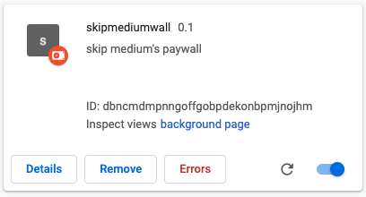

### Skip Medium Wall

Simple Chrome extension to skip Medium's login/paywall. Works based on their policy of not displaying a paywall when navigating in from links that are shared on Twitter.

Note: the extension doesn't currently limit the targets it applies the changes to, because there are Medium posts on custom domains.

#### Developing

On your browser open up the extenstions internal page ([here](chrome://extensions/)). On the top right, enable "Developer mode". A few new buttons should appear at the top of the page. Click "Load unpacked". On the file browser select this directory/folder. You're done.

Every time you make changes to the source code, reload the extension so the changes take effect. Use the "Errors" page to check for errors and the "background page" to check for everything else.

#### Improvements

##### License

Add a `LICENSE.md`.

##### Content

Add the extensions' page.

##### List of targets

Instead of hardcoding the targets for which the extension applies (current
implementation changes the headers on **ALL** requests), allow the
user to target custom URLs. This should be available in the extension's
settings.

##### Setup npm

Setup `npm`.

##### ESLint + Prettier

Setup ESLint and Prettier.

##### Webpack

Setup webpack to have a reproducible way of creating a "publishing" bundle for the extension.

#### Resources

##### Official docs

- [Get started](https://developer.chrome.com/extensions/getstarted)
- [Design UI](https://developer.chrome.com/extensions/user_interface)
- [onBeforeSendHeaders](https://developer.chrome.com/extensions/webRequest#event-onBeforeSendHeaders)
- [No Cookies sample](https://developer.chrome.com/extensions/examples/extensions/no_cookies.zip)
- [Publishing](https://support.google.com/chrome/a/answer/2714278?hl=en)

##### Blog posts

- https://thoughtbot.com/blog/how-to-make-a-chrome-extension
- https://medium.com/better-programming/create-a-chrome-extension-using-react-and-typescript-50e94e14320c
